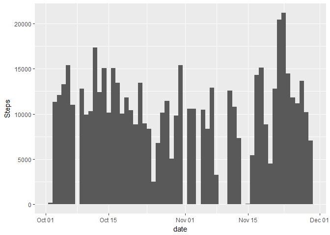
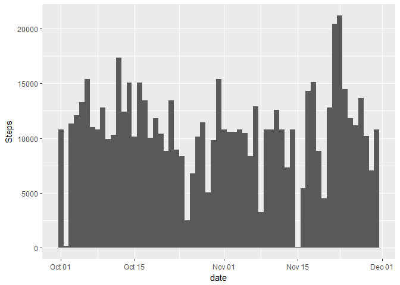

Loading and preprocessing the data
----------------------------------

1.  Load the data
2.  Process/transform the data

<!-- -->

    library(lubridate)
    library(dplyr)
    library(ggplot2)
    library(mice)
    filename <- "activity.csv"
    if (!file.exists(filename)) { 
            unzip("activity.zip") # unzip file data
    }

    df <- read.csv(filename, header=TRUE, na.strings="NA", sep=",", stringsAsFactors = FALSE)
    df$date <- ymd(df$date) # convert to date datatype

What is the mean total number of steps taken per day?
-----------------------------------------------------

1.  Calculate the total number of steps taken per day
2.  Make a histogram of the total number of steps taken each day
3.  Calculate the mean and median of the total number of steps taken per
    day

<!-- -->

    sumsteps <- df %>% 
            filter(!is.na(steps)) %>% ## ignore missing values
            group_by(date) %>% 
            summarise(steps = sum(steps)) ## total steps per day

    qplot(date, data=sumsteps, geom="histogram", weight=steps, ylab="Steps", binwidth=1)

    summary(sumsteps$steps) ## Median / Mean to total steps per day

    ##    Min. 1st Qu.  Median    Mean 3rd Qu.    Max. 
    ##      41    8841   10760   10770   13290   21190

What is the average daily activity pattern?
-------------------------------------------

1.  Make a time series plot of the 5-minute interval (x-axis) and the
    average number of steps taken, averaged across all days (y-axis)
2.  Which 5-minute interval, on average across all the days in the
    dataset, contains the maximum number of steps?

<!-- -->

    avgsteps <- df %>% 
            filter(!is.na(steps)) %>% ## ignore missing values
            group_by(interval) %>% 
            summarise(steps = mean(steps)) %>% ## avg steps per interval
            arrange(desc(steps)) ## sort by steps descending

    qplot(interval, steps, data=avgsteps, geom="line")

    head(avgsteps,1) ## interval 835 averages the most steps

    ## # A tibble: 1 × 2
    ##   interval    steps
    ##      <int>    <dbl>
    ## 1      835 206.1698

Imputing missing values
-----------------------

1.  Calculate and report the total number of missing values in the
    dataset
2.  Fill missing values with mean for that 5-minute interval
3.  Create a new dataset that is equal to the original dataset but with
    the missing data filled in.
4.  Make a histogram of the total number of steps taken each day
5.  Calculate and report the mean and median total number of steps taken
    per day.
6.  Do these values differ from the estimates from the first part of the
    assignment? What is the impact of imputing missing data on the
    estimates of the total daily number of steps?

<!-- -->

    df2 <- df
    md.pattern(df2) ## 2304 rows with NAs

    ##       date interval steps     
    ## 15264    1        1     1    0
    ##  2304    1        1     0    1
    ##          0        0  2304 2304

    df2[is.na(df2),"steps"] <- ## impute missing steps with interval mean
            do.call(rbind, sapply(df2[is.na(df2),"interval"], function(x){
            avgsteps[avgsteps$interval==x,"steps"]}))

    sumsteps2 <- df2 %>% 
            group_by(date) %>% 
            summarise(steps = sum(steps)) ## total steps per day

    qplot(date, data=sumsteps2, geom="histogram", weight=steps, ylab="Steps", binwidth=1)

    summary(sumsteps2$steps)

    ##    Min. 1st Qu.  Median    Mean 3rd Qu.    Max. 
    ##      41    9819   10770   10770   12810   21190

The imputing missing data with the mean of a given interval increased
the median total steps per day by 10. The mean total steps per day did
not change.

Are there differences in activity patterns between weekdays and weekends?
-------------------------------------------------------------------------

1.  Create a new factor variable in the dataset with two levels -
    "weekday" and "weekend" indicating whether a given date is a weekday
    or weekend day.
2.  Make a panel plot containing a time series plot of the 5-minute
    interval (x-axis) and the average number of steps taken, averaged
    across all weekday days or weekend days (y-axis).

<!-- -->

    df2$weekday <- sapply(df2$date, function(x){
            if(weekdays(x) %in% c("Saturday","Sunday")){
                    "weekend"
            }else{
                    "weekday"
            }}) ## Create weekend/weekday factor variable

    avgsteps2 <- df2 %>% 
            group_by(interval,weekday) %>% 
            summarise(steps = mean(steps)) ## avg steps per interval / weekday

    qplot(interval,steps, data=avgsteps2, geom="line", facets=weekday~.)

